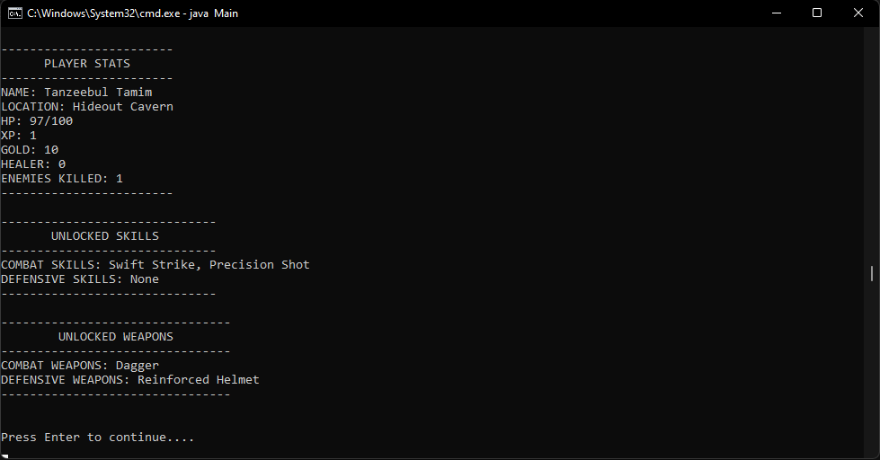

# Age of The Evil Emperor - A Java-Based Text RPG Game

Welcome to the repository for the Java Text-Based RPG Game! This project is a command-line role-playing game built in Java, where players embark on an adventure, face enemies, explore new locations, and level up their characters.

## Table of Contents

- [Game Features](#game-features)
- [Game Availability](#game-availability)
- [Used Packages and Technologies](#used-packages-and-technologies)
- [Prerequisites](#prerequisites)
- [Installation](#installation)
- [Running the Game](#running-the-game)
- [Contributing](#contributing)
- [License](#license)

## Game Features

- **_Title Screen:_**
<p align="center">  
     
</p>

- **_Character Creation:_** Players can create and customize their character by choosing attributes like name and initial skills.
<p align="center">
   
   
</p>

<br/>

- ***Unlockable Weapons, Skills, and Equipment:*** As players progress through the game, they gain access to a variety of combat weapons, unique skills, and defensive equipment. These unlocks allow players to customize their playstyle, enhance their combat effectiveness, and strategize for tougher battles. Whether it's mastering powerful abilities or equipping the best armor, progression is key to becoming a formidable adventurer.  
<p align="center">  
     
     
     
</p>

- **_Battle System:_** The game features a turn-based combat system where players fight against various enemies, leveling up as they progress. During battles, players can strategically use items such as healers to restore health or choose to run away if the situation becomes too dangerous.
<p align="center">  
     
     
     
</p>

- **_Exploration:_** Players can explore different locations and discover quests that add to the storyline.
<p align="center">
   
</p>

- **_Player Stats and Inventory System:_** The game includes a dynamic inventory system, allowing players to collect and use items such as potions, weapons, and armor. Additionally, players can monitor their stats, including health, attack power, defense, and gold, all of which are crucial for gameplay progression. The stats update dynamically as the player levels up or equips new items.
   <p align="center">
      
      
   </p>

- **_Leveling Up:_** As players defeat enemies and complete quests, they gain experience points to level up their character, unlocking new abilities.
<p align="center">
   
</p>

- **_Enemies & Boss Fights:_** The game includes a variety of enemies with unique abilities, culminating in exciting boss fights that test the player's strategy.
<p align="center">
   
</p>

- **_Storyline & Quests:_** The game features an immersive storyline with multiple quests and side missions, giving players many paths to explore and decisions to make.
<p align="center">
   
</p>

## Game Availability

Currently, this project is a command-line game and does not have a live deployment. To play, follow the instructions in the [Installation](#installation) and [Running the Game](#running-the-game) sections.

## Used Packages and Technologies

- **Java**: Programming language used to develop the game.
- **Java.util.Scanner**: For reading player inputs during gameplay.
- **Java.util.ArrayList**: For storing dynamic lists, such as the player’s inventory or enemies.
- **Java.util.Random**: For random number generation in battle and exploration events.
- **OOP Design Patterns**: For structuring the game’s code, using classes like `Player`, `Enemy`, `Character`, `Item` etc.

## Prerequisites

- JDK 11 or higher
- A text editor or IDE (e.g., IntelliJ IDEA, Eclipse, Visual Studio Code)

## Installation

1. Clone the repository:

   ```sh
   git clone https://github.com/Tanzeebul-Tamim/Age-of-The-Evil-Emperor.git
   cd Age-of-The-Evil-Emperor
   ```

2. Create a `bin` directory at the root level to store compiled `.class` files:

   ```sh
   mkdir bin
   ```

3. Compile the game files into the `bin` directory, preserving the folder structure:
   ```sh
   javac -d bin src/Main.java src/main/*.java
   ```

## Running the Game

1. Navigate to the `bin` directory:

   ```sh
   cd bin
   ```

2. Run the game using the `java` command:
   ```sh
   java Main
   ```

Once you run the game, follow the on-screen prompts to create your character, explore, battle enemies, and complete quests!

## Contributing

Feel free to fork the repository and submit pull requests. Contributions are welcome, including bug fixes, new features, and improvements.

## License

This project is licensed under the MIT License - see the [LICENSE](LICENSE) file for details.
